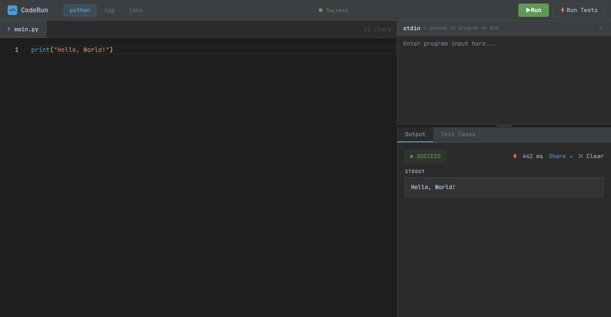

# CodeRun — Sandboxed Remote Code Execution Engine

Safely runs untrusted code inside isolated Docker containers. Supports Python, C++, and Java with asynchronous job processing, test case validation, and shareable execution links.

---

## Demo

Write code directly in the browser — no setup required.

```python
n = int(input())
print(n * 2)

# stdin: 5 → stdout: 10
```

---

## Screenshots

| Editor + Execution | Test Case Runner | Share Page |
|---|---|---|
|  |  |  |

---

## Features

- **Multi-language** — Python 3.11, C++ (GCC), Java 21
- **Sandboxed containers** — 128MB RAM cap, no network, 10s timeout
- **Stdin support** — works with `input()` / `cin` / `Scanner`
- **Test case runner** — run N inputs in parallel, get pass/fail per case
- **Execution history** — last 20 runs stored in Redis, 7-day TTL
- **Shareable links** — any execution shareable via `/s/:id`
- **Rate limiting** — 30 requests/min per IP
- **Real-time status** — pulsing indicator while code runs

---

## Tech Stack

| Layer | Technology |
|---|---|
| Frontend | React + Vite + TypeScript |
| Editor | Monaco Editor (same engine as VS Code) |
| Backend | Node.js + Express + TypeScript |
| Queue | Bull + Redis |
| Sandboxing | Docker |
| Logging | Pino |
| Styling | Tailwind CSS |

---

## Getting Started

### Prerequisites
- Docker Desktop (running)
- Node.js 18+

### Run with Docker Compose

```bash
git clone https://github.com/poojithpagadekal/remote-code-executor
cd remote-code-executor
cp .env.example .env
docker-compose up --build
```

| Service | URL |
|---|---|
| Frontend | http://localhost:5173 |
| API | http://localhost:3000 |

### Local Development (hot reload)

Run only Redis in Docker, start the app directly for instant reload without rebuilding images.

```bash
# 1. Start Redis
docker run -d -p 6379:6379 --name redis-dev redis:alpine

# 2. Set REDIS_URL=redis://localhost:6379 in .env

# Terminal 1 — backend
npm run dev

# Terminal 2 — frontend
cd client && npm run dev
```

> **Tip:** Keep `.env` for local dev (`localhost`) and `.env.docker` for Docker Compose (`redis` hostname) to avoid switching manually.

### Environment Variables

```env
PORT=3000
REDIS_URL=redis://redis:6379
HOST_TEMP_PATH=/absolute/path/to/remote-code-executor/temp
CORS_ORIGIN=http://localhost:5173
NODE_ENV=development
```

> **Windows:** `HOST_TEMP_PATH` must be an absolute path, e.g. `C:/Users/username/remote-code-executor/temp`.

---

## API Reference

### Execute Code — `POST /api/execute`

```json
// Request
{ "language": "python", "code": "name = input()\nprint(f'Hello {name}')", "stdin": "Poojith" }

// Response
{ "id": "550e8400...", "stdout": "Hello Poojith", "stderr": "", "exitCode": 0, "status": "success", "executionTime": 623 }
```

**Status values:** `success` · `compile_error` · `runtime_error` · `timeout`

### Run Test Cases — `POST /api/execute/test`

```json
// Request
{ "language": "python", "code": "n = int(input())\nprint(n * 2)", "testCases": [{ "input": "5", "expected": "10" }] }

// Response
{ "results": [{ "index": 1, "input": "5", "expected": "10", "actual": "10", "passed": true, "executionTime": 601 }], "passed": 1, "failed": 0, "total": 1 }
```

Test cases execute in parallel up to the queue concurrency limit (5 simultaneous containers).

### Execution History

```
GET /api/executions       # Last 20 executions
GET /api/executions/:id   # Single execution by ID
```

---

## Architecture

```
                        ┌─────────────────────────────────┐
                        │           React Frontend         │
                        │   Monaco Editor + Test Cases     │
                        └──────────────┬──────────────────┘
                                       │ HTTP POST /api/execute
                        ┌──────────────▼──────────────────┐
                        │        Express API Server        │
                        │   Rate Limiting + Validation     │
                        └──────────────┬──────────────────┘
                                       │
                        ┌──────────────▼──────────────────┐
                        │         Bull Job Queue           │
                        │     Max 5 Concurrent Jobs        │
                        └──────────────┬──────────────────┘
                                       │
                   ┌───────────────────┼───────────────────┐
                   │                   │                   │
        ┌──────────▼────────┐ ┌────────▼────────┐ ┌───────▼──────────┐
        │   Python Worker   │ │   C++ Worker    │ │   Java Worker    │
        │ python:3.11-slim  │ │  gcc:latest     │ │ eclipse-temurin  │
        └───────────────────┘ └─────────────────┘ └──────────────────┘
                                       │
                        ┌──────────────▼──────────────────┐
                        │              Redis               │
                        │   Job Queue + Execution History  │
                        └─────────────────────────────────┘
```

## Execution Pipeline

```
1.  POST /api/execute → validate language, code length, rate limit
2.  Job enqueued in Bull (persisted in Redis)
3.  Worker picks up job (max 5 concurrent)
4.  Code + stdin written to temp files on host
5.  Docker container spun up with both files bind-mounted (read-only)
6.  Container runs: python code.py < stdin.txt
7.  stdout/stderr captured; container auto-removed on exit
8.  Result saved to Redis with 7-day TTL
9.  Response: { id, stdout, stderr, status, executionTime }
```

---

## Security Model

| Threat | Mitigation |
|---|---|
| Host filesystem access | Read-only bind mount |
| Network exfiltration | `NetworkMode: none` |
| Memory exhaustion | 128MB RAM hard limit |
| Infinite loops / forkbombs | 10s timeout → `SIGKILL` |
| API abuse | 30 req/min rate limiting per IP |
| Shell injection via stdin | stdin written to file, never shell-interpolated |
| Container flooding | Bull queue caps at 5 concurrent containers |

---

## Performance

| Stage | Time |
|---|---|
| API validation + queue dispatch | ~10ms |
| Worker pickup | ~5ms |
| Temp file write | ~5ms |
| Docker container startup | ~500–900ms |
| Code execution | ~5–50ms |
| Result capture + cleanup | ~50ms |
| **Total p95** | **~838ms** |

Container cold start dominates. A pre-warmed container pool would cut this significantly but adds operational complexity not warranted here.

---

## Load Testing

Tests run using [k6](https://k6.io) against the full stack locally.

**Test 1 — Sustained (5 VUs, 30s)**
- 131 total requests at 4.25/s
- 77% rejected by rate limiter — expected behavior
- All requests that passed the limiter executed successfully
- p95 latency: 901ms

**Test 2 — Burst (20 VUs, 10s)**
- 100% success rate, no dropped requests
- Excess requests queued in Bull and drained in batches
- High avg latency (21s) reflects queue wait, not execution time

**Test 3 — Timeout (5 VUs, infinite loops, 15s)**
- All containers killed at exactly 10s
- 100% returned `status: "timeout"`, no zombie containers

```bash
k6 run load-test.js                          # sustained
k6 run --vus 20 --duration 10s load-test.js  # burst
k6 run --vus 5 --duration 15s load-test.js   # timeout
```

---

## Project Structure

```
remote-code-executor/
├── src/
│   ├── modules/
│   │   ├── execution/     # Docker executors, Bull queue, worker, routes
│   │   └── history/       # Execution history API backed by Redis
│   ├── config/            # Env vars, logger, Redis client
│   ├── middleware/        # Global error handler
│   └── server.ts
├── client/
│   ├── src/
│   │   ├── api/           # Axios client + typed execution functions
│   │   ├── components/    # header/, output/, testcases/, StdinPanel, BottomPanel
│   │   ├── hooks/         # useCodeEditor, useExecution, useTestCases, useStdinPanel
│   │   └── pages/         # SharePage
├── load-test.js
├── docker-compose.yml
├── Dockerfile
└── .env.example
```

---

## Known Limitations

- **~500–900ms cold start per execution** — fresh container per submission; pre-warmed pool is the fix but adds complexity.
- **Single file only** — multi-file projects aren't supported. Extending to directory mounts is straightforward.
- **Single worker process** — Bull supports horizontal scaling with no code changes; current setup runs one process with 5 concurrent jobs.
- **No user accounts** — all executions are anonymous.
