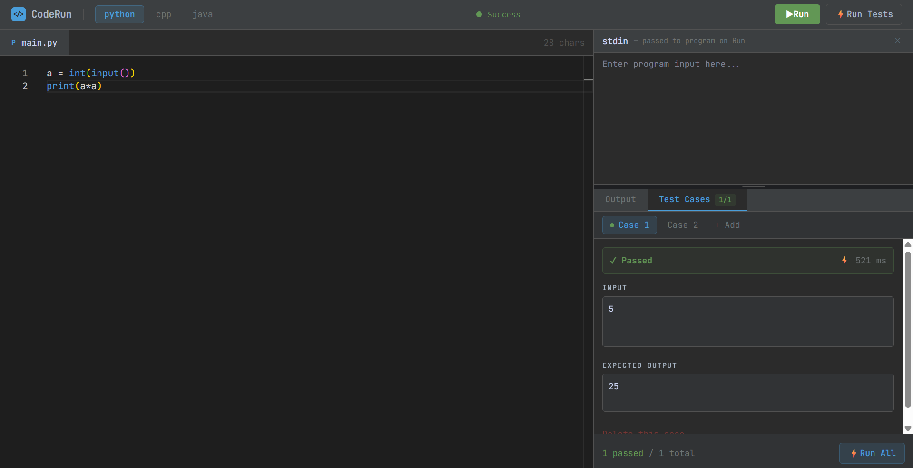
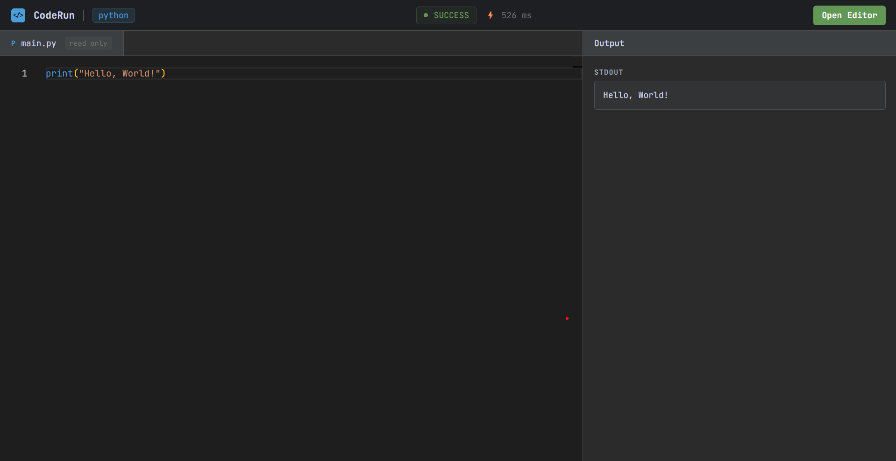

# CodeRun — Sandboxed Remote Code Execution Engine

A production-grade code execution engine that safely runs untrusted code inside isolated Docker containers. Supports Python, C++, and Java with asynchronous job processing, test case validation, and shareable execution links.

---

## Demo

Write code in Python, C++, or Java directly from the browser. Code runs inside an isolated Docker container — no setup required.

```python
# Example
n = int(input())
print(n * 2)

# stdin: 5
# stdout: 10
```

---

## Screenshots

### Editor + Execution


### Test Case Runner


### Share Page


---

## Architecture

```
                        ┌─────────────────────────────────┐
                        │           React Frontend         │
                        │   Monaco Editor + Test Cases     │
                        └──────────────┬──────────────────┘
                                       │ HTTP POST /api/execute
                        ┌──────────────▼──────────────────┐
                        │        Express API Server        │
                        │   Rate Limiting + Validation     │
                        └──────────────┬──────────────────┘
                                       │
                        ┌──────────────▼──────────────────┐
                        │         Bull Job Queue           │
                        │     Max 5 Concurrent Jobs        │
                        └──────────────┬──────────────────┘
                                       │
                   ┌───────────────────┼───────────────────┐
                   │                   │                   │
        ┌──────────▼────────┐ ┌────────▼────────┐ ┌───────▼──────────┐
        │   Python Worker   │ │   C++ Worker    │ │   Java Worker    │
        │ python:3.11-slim  │ │  gcc:latest     │ │ eclipse-temurin  │
        │ Docker container  │ │ Docker container│ │ Docker container │
        └───────────────────┘ └─────────────────┘ └──────────────────┘
                                       │
                        ┌──────────────▼──────────────────┐
                        │              Redis               │
                        │   Job Queue + Execution History  │
                        └─────────────────────────────────┘
```

---

## Execution Pipeline

Every code submission follows this exact path:

```
1.  Frontend sends POST /api/execute with code, language, and stdin
2.  API validates language, code length, and rate limit
3.  Job is enqueued into Bull (persisted in Redis)
4.  Worker picks up the job — max 5 running simultaneously
5.  Code is written to a temp file on the host
6.  stdin is written to a separate .stdin temp file
7.  Docker container is created with both files bind-mounted (read-only)
8.  Container runs: python code.py < stdin.txt
9.  stdout and stderr are captured via Docker stream demuxing
10. Container exits — AutoRemove cleans it up
11. Result is returned through the queue to the API
12. Result is saved to Redis with 7-day TTL
13. Response sent to frontend: id, stdout, stderr, status, executionTime
```

---

## Key Design Decisions

### Why Docker for sandboxing?
Each code submission runs in an isolated Docker container with strict resource limits. This prevents:
- **Filesystem access** — container has a read-only bind mount, no host access
- **Memory bombs** — each container is capped at 128MB RAM
- **Network attacks** — containers run with `NetworkMode: none`
- **Infinite loops** — containers are killed after 10 seconds with `SIGKILL`

### Why Bull + Redis for the queue?
Direct execution would allow unlimited concurrent containers, crashing the server under load. Bull provides:
- **Controlled concurrency** — max 5 containers running simultaneously
- **Job persistence** — if the server crashes, queued jobs survive in Redis
- **Backpressure** — excess requests queue in Redis instead of being dropped

### Why file-based stdin?
Passing stdin through Docker's attach stream API is unreliable on Windows due to stream multiplexing behaviour. Writing stdin to a `.stdin` temp file on the host, bind-mounting it into the container read-only, and redirecting with `< stdin.txt` in the shell command works consistently across all platforms — the same pattern used by production online judges.

### Why Redis for execution history?
Redis is already running for Bull. Reusing it for history means no additional infrastructure. A 7-day TTL means stale records expire automatically with no cleanup code. The history list is capped at 20 entries using `LTRIM` to keep memory bounded.

---

## Performance

Typical execution latency breakdown:

| Stage | Time |
|---|---|
| API validation + queue dispatch | ~10ms |
| Worker pickup from Redis | ~5ms |
| Temp file write | ~5ms |
| Docker container startup | ~500–900ms |
| Code execution | ~5–50ms |
| Result capture + cleanup | ~50ms |
| **Total (observed p95)** | **~838ms** |

The dominant cost is Docker container cold start. See [Known Limitations](#known-limitations) for context.

---

## Load Testing

Load tests were run using [k6](https://k6.io) against the `/api/execute` endpoint. All tests ran against the full stack locally via `docker-compose up`.

### Test 1 — Sustained load (5 VUs, 30 seconds)

```
Scenario:  5 virtual users, 30s, simple Python print statement

checks_total:      262
checks_succeeded:  22.90% (60/262)  — rate limiter working as expected
checks_failed:     77.09% (202/262) — 429s from 30 req/min limit

http_req_duration (successful requests only):
  avg:   661ms
  p(90): 890ms
  p(95): 901ms

http_reqs: 131 total at 4.25/s
```

The high check failure rate reflects the rate limiter doing its job. 5 VUs sending ~4 req/s exceeds the 30 req/min cap almost immediately. Every request that passed the rate limit executed successfully.

---

### Test 2 — Burst (20 VUs, 10 seconds)

```
Scenario:  20 virtual users, 10s burst

checks_total:      30
checks_succeeded:  100% (30/30)
checks_failed:     0%

http_req_duration:
  avg:   21.52s
  min:   10.64s
  max:   32.37s
  p(90): 32.34s
  p(95): 32.36s

http_reqs: 15 completed, 5 interrupted (test ended before queue drained)
```

20 simultaneous requests hit a queue capped at 5 concurrent jobs. Requests beyond the concurrency limit queued in Bull and were processed in batches — no requests dropped, no server errors. The high average latency reflects queue wait time, not execution time. The 5 interrupted iterations were still in queue when the 10s test window closed.

---

### Test 3 — Timeout handling (5 VUs, infinite loops, 15 seconds)

```
Scenario:  5 virtual users submitting while True: pass

checks_total:      20
checks_succeeded:  100% (20/20)
checks_failed:     0%

http_req_duration:
  avg:   10.78s
  min:   10.62s
  max:   10.87s
```

All 5 containers ran for exactly 10 seconds before being killed with `SIGKILL`. The API returned `status: "timeout"` for every submission. No zombie containers, no server degradation after the test.

---

### Running the load tests yourself

```bash
# Install k6 (Windows)
choco install k6

# Install k6 (macOS)
brew install k6
```

```bash
k6 run load-test.js                          # sustained load
k6 run --vus 20 --duration 10s load-test.js  # burst
k6 run --vus 5 --duration 15s load-test.js   # timeout (change code to while True: pass)
```

---

## Features

- **Multi-language execution** — Python 3.11, C++ (GCC), Java 21
- **Sandboxed containers** — memory limits, no network, 10s timeout per execution
- **Stdin support** — pass input to programs that use `input()` / `cin` / `Scanner`
- **Multiple test cases** — run code against N inputs in parallel, get pass/fail per case
- **Execution history** — last 20 runs stored in Redis with 7-day TTL
- **Shareable links** — share any execution via `/s/:id`, opens read-only view
- **Rate limiting** — 30 requests per minute per IP
- **Structured logging** — Pino JSON logs with timestamps and request context
- **Real-time status** — pulsing execution status indicator in the UI

---

## Tech Stack

| Layer | Technology | Why |
|---|---|---|
| Frontend | React + Vite + TypeScript | Fast dev server, full type safety |
| Editor | Monaco Editor | Same engine as VS Code |
| Backend | Node.js + Express + TypeScript | Great Docker SDK support |
| Queue | Bull + Redis | Job persistence, concurrency control |
| Sandboxing | Docker | Process isolation, resource limits |
| Logging | Pino | Structured JSON logs, minimal overhead |
| Styling | Tailwind CSS | Utility-first, consistent design system |

---

## Project Structure

```
remote-code-executor/
├── src/
│   ├── modules/
│   │   ├── execution/     # Docker executors, Bull queue, worker, routes
│   │   └── history/       # Execution history API backed by Redis
│   ├── config/            # Environment variables, logger, Redis client
│   ├── middleware/        # Global error handler
│   └── server.ts          # Entry point
├── client/                # React frontend (Monaco editor, test cases, share page)
├── docs/                  # Screenshots
├── load-test.js           # k6 load testing script
├── docker-compose.yml     # Redis + API + frontend
├── Dockerfile
└── .env.example
```

---

## Getting Started

### Prerequisites
- Docker Desktop (running)
- Node.js 18+

### Running

```bash
git clone https://github.com/poojithpagadekal/remote-code-executor
cd remote-code-executor

cp .env.example .env

docker-compose up --build
```

All three services start with one command.

| Service | URL |
|---|---|
| Frontend | http://localhost:5173 |
| API | http://localhost:3000 |

### Running manually (for frontend hot reload during development)

```bash
npm install
cd client && npm install && cd ..

# Terminal 1 — Redis + API
docker-compose up redis api

# Terminal 2 — Frontend
cd client && npm run dev
```

### Environment Variables

```env
PORT=3000
REDIS_URL=redis://redis:6379
HOST_TEMP_PATH=/absolute/path/to/remote-code-executor/temp
CORS_ORIGIN=http://localhost:5173
NODE_ENV=development
```

> **Windows:** `HOST_TEMP_PATH` must be an absolute Windows path, e.g.
> `C:/Users/username/remote-code-executor/temp`
> Docker on Windows cannot resolve relative paths for bind mounts.

---

## API Reference

### Execute Code

```
POST /api/execute
```

**Request:**
```json
{
  "language": "python",
  "code": "name = input()\nprint(f'Hello {name}')",
  "stdin": "Poojith"
}
```

**Response:**
```json
{
  "id": "550e8400-e29b-41d4-a716-446655440000",
  "stdout": "Hello Poojith",
  "stderr": "",
  "exitCode": 0,
  "status": "success",
  "executionTime": 623
}
```

**Status values:**

| Status | Meaning |
|---|---|
| `success` | Program exited with code 0 |
| `compile_error` | Compilation failed (C++ / Java) |
| `runtime_error` | Program crashed at runtime |
| `timeout` | Exceeded 10 second limit |

---

### Run Test Cases

```
POST /api/execute/test
```

**Request:**
```json
{
  "language": "python",
  "code": "n = int(input())\nprint(n * 2)",
  "testCases": [
    { "input": "5", "expected": "10" },
    { "input": "3", "expected": "6"  },
    { "input": "0", "expected": "1"  }
  ]
}
```

**Response:**
```json
{
  "results": [
    { "index": 1, "input": "5", "expected": "10", "actual": "10", "passed": true,  "executionTime": 601 },
    { "index": 2, "input": "3", "expected": "6",  "actual": "6",  "passed": true,  "executionTime": 589 },
    { "index": 3, "input": "0", "expected": "1",  "actual": "0",  "passed": false, "executionTime": 574 }
  ],
  "passed": 2,
  "failed": 1,
  "total": 3
}
```

All test cases execute in parallel — N test cases take the same wall-clock time as 1.

---

### Execution History

```
GET /api/executions          # Last 20 executions
GET /api/executions/:id      # Single execution by ID
```

---

## Security Model

| Threat | Mitigation |
|---|---|
| Host filesystem access | Read-only bind mount — container cannot write to host |
| Network exfiltration | `NetworkMode: none` — zero internet inside container |
| Memory exhaustion | 128MB RAM hard limit enforced by Docker |
| Infinite loops / forkbombs | 10s timeout — container killed with `SIGKILL` |
| API abuse | 30 requests/minute rate limiting per IP |
| Shell injection via stdin | stdin written to file, redirected with `<` — never shell-interpolated |
| Container flooding | Bull queue caps at 5 simultaneous containers |

---

## Known Limitations

**Container startup adds ~500–900ms per execution**
The system spins up a fresh Docker container for every submission. This is the safest isolation approach but the cold start dominates the latency profile. The architecture is compatible with a pre-warmed container pool — containers could be kept alive and reused — but that adds significant complexity that wasn't warranted here.

**One file per submission**
Each execution mounts a single source file. Projects that span multiple files aren't supported. Extending this would mean mounting a directory and adjusting the compile command — the Docker mount strategy already handles this pattern internally.

**Workers run in a single process**
Bull supports running multiple worker processes across multiple machines with no code changes — scaling out is purely operational. The current setup runs one worker process handling up to 5 concurrent jobs.

**No user accounts**
All executions are anonymous. User accounts would unlock per-user history, private share links, and finer-grained rate limiting.