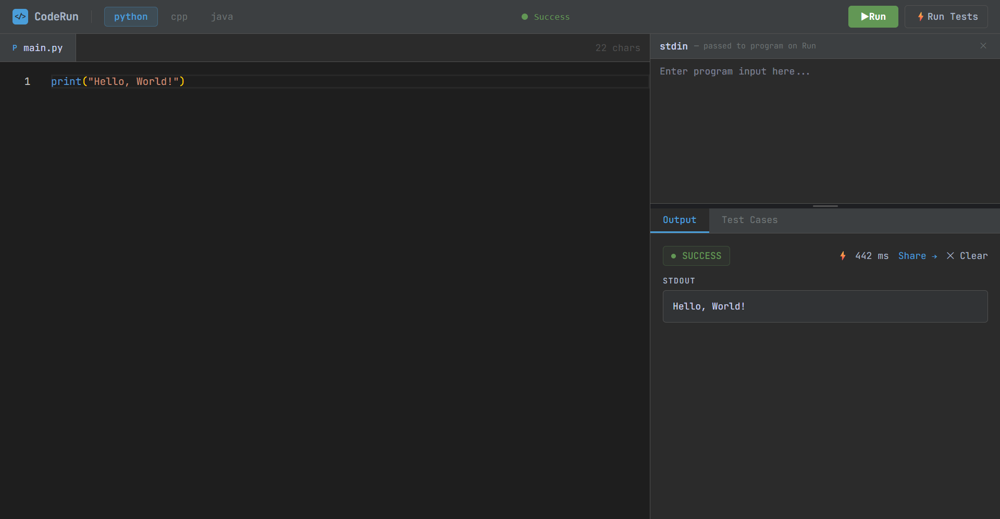
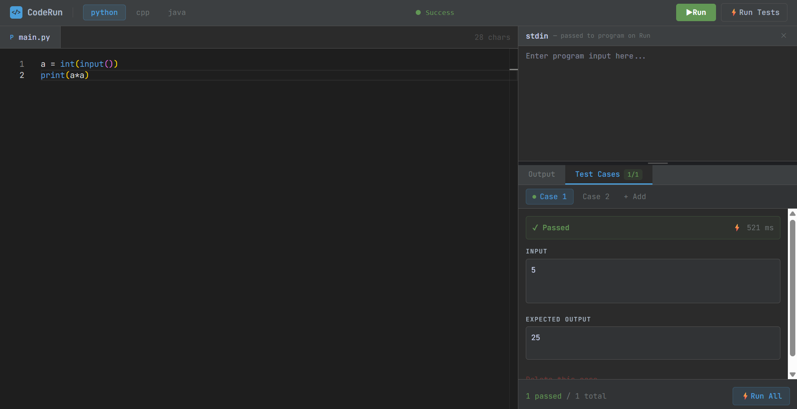
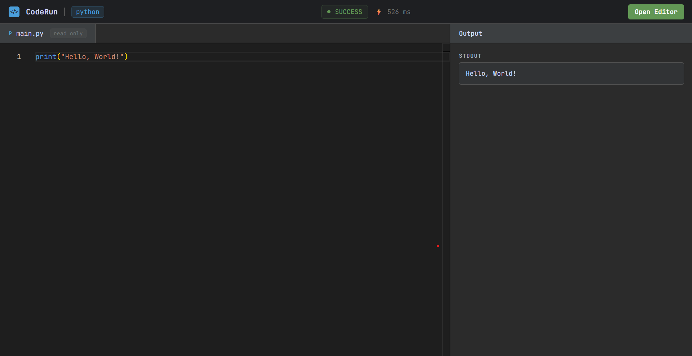

# CodeRun — Sandboxed Remote Code Execution Engine

Run untrusted Python, C++, and Java inside isolated Docker containers, with async job queuing, test-case validation, and shareable execution links.

| Editor + Execution | Test Case Runner | Share Page |
|---|---|---|
|  |  |  |

## Features

- Python 3.11, C++ (GCC), and Java 21, with stdin support
- One fresh Docker sandbox per submission: no network, 128MB RAM cap, 10s timeout
- Redis-backed Bull queue capping execution at 5 concurrent containers
- Multiple test cases with pass/fail per case
- Shareable links (`/s/:id`) and execution history (last 20 runs, 7-day TTL)
- Rate limiting (30 req/min per IP) and structured logging (Pino)

## Quick Start

**Prerequisites:** Docker Desktop (running), Node.js 18+

```bash
git clone https://github.com/poojithpagadekal/remote-code-executor
cd remote-code-executor
cp .env.example .env
docker-compose up --build
```

Frontend: http://localhost:5173 | API: http://localhost:3000

> **Windows:** set `HOST_TEMP_PATH` in `.env` to an absolute path (e.g. `C:/Users/you/remote-code-executor/temp`). Docker on Windows can't resolve relative bind-mount paths.

## Architecture

```
React Frontend
      │  POST /api/execute
      ▼
Express API (validation + rate limiting)
      │
      ▼
Bull Queue  ◄──────►  Redis (queue storage + execution history)
      │
      ▼
Worker (max 5 concurrent)
      │
      ▼
Docker Container (Python / C++ / Java)
```

Each submission is validated and enqueued. A worker writes the code and stdin to temp files, starts a fresh container with those files bind-mounted read-only, captures stdout/stderr, removes the container, and stores the result in Redis (7-day TTL).

## Design Decisions

- **Docker per submission:** every run gets a clean, isolated environment with strict resource limits.
- **Queue for load control:** caps concurrency at 5 containers, keeps queued jobs in Redis, and absorbs bursts instead of running every submission immediately.
- **File-based stdin:** stdin is written to a temp file and redirected with `<`, which avoids shell interpolation (and Docker's attach stream proved unreliable on Windows).
- **Redis reused for history:** it already backs the queue, so no second data store is needed. TTL expires old records and `LTRIM` caps the list at 20.

## Security Model

| Threat | Mitigation |
|---|---|
| Host filesystem writes | Read-only bind mount |
| Network exfiltration | `NetworkMode: none` |
| Memory exhaustion | 128MB RAM hard limit |
| Execution timeout | 10s timeout, `SIGKILL` |
| Shell injection via stdin | File-based stdin, never interpolated |
| Container flooding | Queue caps at 5 concurrent |
| API abuse | 30 req/min per IP |

## Performance

Measured locally on Docker Desktop (Windows), not production benchmarks. Single-execution p95 is about **838ms**, dominated by container startup (~500-900ms). Load tested with [k6](https://k6.io):

| Test | Setup | Result |
|---|---|---|
| Sustained | 5 VUs, 30s | Rate limiter rejected ~77% of requests (429); all requests under the cap succeeded, p95 ≈ 901ms |
| Burst | 20 VUs, 10s | Queue held at 5 concurrent jobs; 0 execution errors; high latency reflects queue wait |
| Timeout | 5 VUs, infinite loops, 15s | All containers killed at 10s, API returned `timeout`, no zombie containers |

## API

| Endpoint | Input | Returns |
|---|---|---|
| `POST /api/execute` | `language`, `code`, `stdin` | `stdout`, `stderr`, `exitCode`, `status`, `executionTime` |
| `POST /api/execute/test` | `language`, `code`, `testCases` (`input` / `expected`) | per-case results, plus `passed`, `failed`, `total` |
| `GET /api/executions` | none | last 20 executions |
| `GET /api/executions/:id` | none | a single execution |

`status` is one of `success`, `compile_error`, `runtime_error`, `timeout`.

## Limitations & Future Improvements

### Current limitations
- ~500-900ms cold start per execution (a fresh container per submission)
- Single worker process; horizontal scaling not configured yet
- One file per submission; no user accounts
- No automated test suite yet (validated manually and with k6)

### Future improvements
- Pre-warmed container pool
- CPU and PID limits alongside memory limits
- Multi-worker scaling
- Automated tests and CI pipeline
- Stronger isolation (gVisor / Firecracker) for multi-tenant use

## Tech Stack

| Layer | Technology |
|---|---|
| Frontend | React, Vite, TypeScript, Tailwind CSS |
| Editor | Monaco Editor |
| Backend | Node.js, Express, TypeScript |
| Queue | Bull, Redis |
| Sandbox | Docker |
| Logging | Pino |
